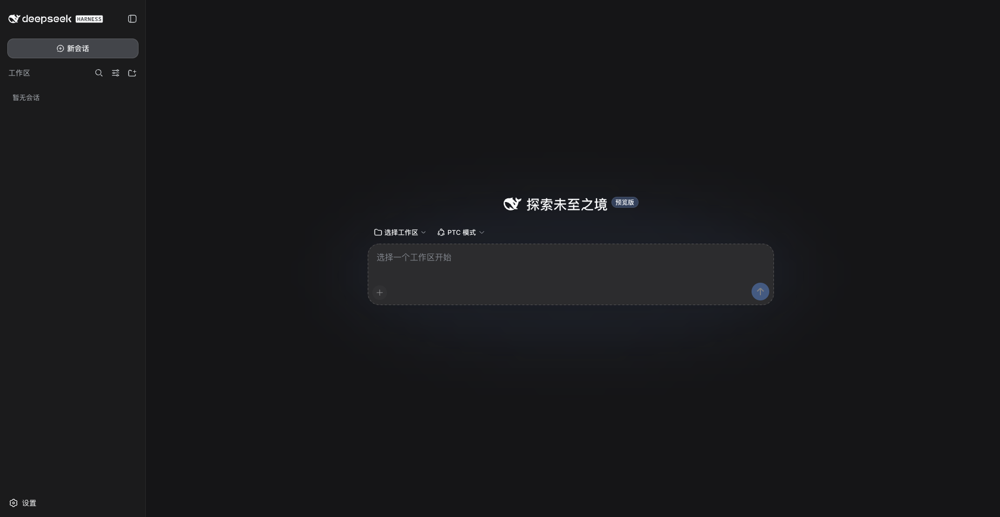
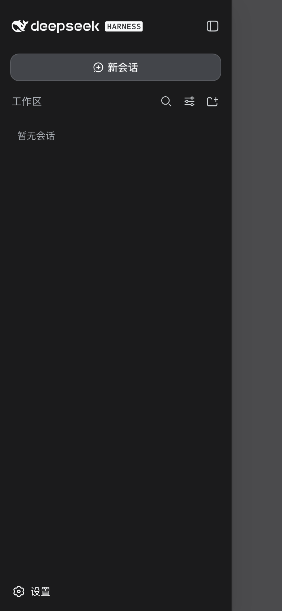

# DeepSeek Harness Mobile & Remote Adapter

English | [中文](README.zh.md)

Makes [DeepSeek Harness](https://github.com/deepseek-ai/deepseek-harness) usable on your **phone** and from **anywhere**: responsive mobile UI + LAN / public-server (FRP) remote access.

## Highlights

- 📱 **Mobile UI**: below 768px the three-column layout becomes a single column — sidebar becomes a drawer, details becomes a full-screen slide-over, 15+ components get touch-friendly sizing.
- 🏠 **LAN access**: `--host 0.0.0.0` works out of the box; the `/api` trust fence auto-allows LAN IPs derived from the bind.
- 🌍 **FRP public tunneling**: with any public server you can reach dsh from anywhere; guide includes Nginx + HTTPS + Basic Auth hardening.
- 🔧 **Fixes for non-HTTPS origins**: `crypto.randomUUID` crash and the onboarding notice that kept reappearing.

## Screenshots

| Desktop | Mobile drawer |
|---|---|
|  |  |

## Quick start

```sh
# 1. Clone this repo and the base repo
git clone https://github.com/weimeng8888/DeepSeek-Harness-Mobile-Remote.git
git clone https://github.com/deepseek-ai/deepseek-harness.git

# 2. Apply the patch (tries git apply, falls back to overlay copy)
cd DeepSeek-Harness-Mobile-Remote
./scripts/apply.sh ../deepseek-harness

# 3. Install and build
cd ../deepseek-harness
pnpm install && pnpm run build

# 4. Serve on the LAN (phone and computer on the same Wi-Fi)
export DEEPSEEK_API_KEY="sk-your-key"
node --import tsx/esm apps/cli/src/bin.ts web --host 0.0.0.0 --port 3700
```

The startup log prints the LAN URL, e.g. `dsh web: http://192.168.1.42:3700`. Open it on your phone.

## FRP public tunneling (highlight)

With a public server, tunnel the local 3700 port through [FRP](https://github.com/fatedier/frp) and access dsh from anywhere:

```sh
# On the VPS:   frps -c frps.toml     (sample: frp/frps.toml)
# On your Mac:  frpc -c frpc.toml     (sample: frp/frpc.toml)
# Start dsh authorizing the public domain:
node --import tsx/esm apps/cli/src/bin.ts web --host 0.0.0.0 --port 3700 \
  --trusted-host dsh.example.com
```

⚠️ **Authentication is mandatory**: dsh can execute code, so a naked tunnel lets anyone use your machine. Full guide — Nginx + HTTPS + Basic Auth, stcp mode with no public port, troubleshooting — in [docs/FRP-GUIDE.zh.md](docs/FRP-GUIDE.zh.md).

## Repository layout

```
mobile-remote.patch        one-shot patch (git apply)
overlay/                   full modified source files (manual overlay)
scripts/apply.sh           auto-apply script
scripts/dsh-web.sh         start/stop/status helper
frp/                       FRP sample configs (frps/frpc/nginx)
docs/CHANGED-FILES.md      what changed in every file
docs/FRP-GUIDE.zh.md       full FRP tunneling tutorial
```

This is a source-level patch, not a plug-and-play plugin (the mobile UI lives inside each package's private CSS Modules and React components, which external plugins cannot override). Built against `deepseek-harness` commit `47f9438`.

## License

MIT, same as upstream.
